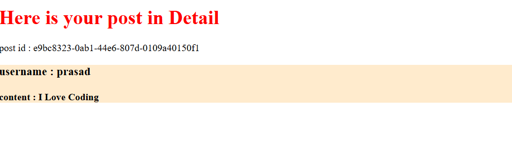
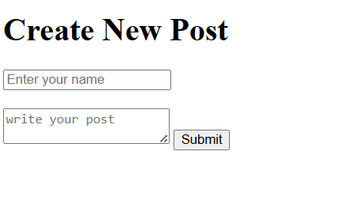
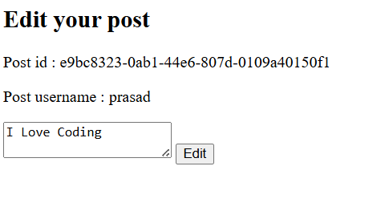

# 🌐 RESTful APIs Quora

A **Quora-inspired RESTful web app** built with **Node.js, Express & EJS**.  
It demonstrates **CRUD operations** with clean and styled views (`index`, `show`, `new`, `edit`).  
This project is a simple yet powerful way to understand **RESTful APIs** and **full-stack basics**. 🚀  

---

## ✨ Features
- 📝 Create, view, edit, and delete Q&A posts  
- 🎨 Clean UI with custom CSS styling  
- ⚡ RESTful routes following best practices  
- 📄 EJS views for dynamic rendering  

---

## 📂 Project Structure
Restful-apis-quora/
│── views/
│ ├── index.ejs
│ ├── show.ejs
│ ├── new.ejs
│ └── edit.ejs
│── public/
│ └── style.css
│── index.js
│── package.json

📸 Screenshots

### Index Page


### Show Page


### New Page


### Edit Page


## 🚀 Installation & Setup
```bash
# Clone the repository
git clone https://github.com/DurgaPrasadKattunga/restful-apis-quora.git

# Navigate into the project folder
cd restful-apis-quora

# Install dependencies
npm install express
npm install method-override
npm install uuid

# Run the server
node index.js